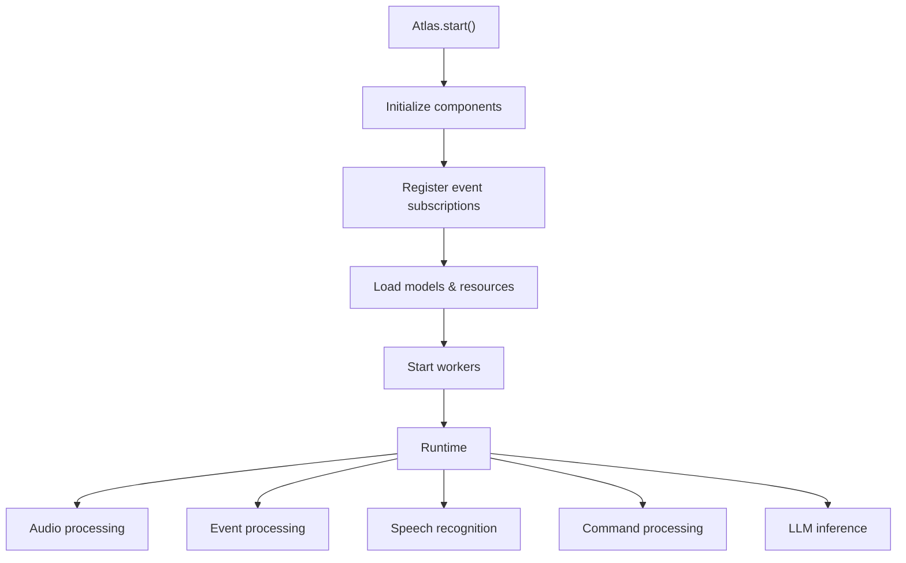
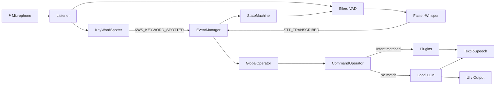
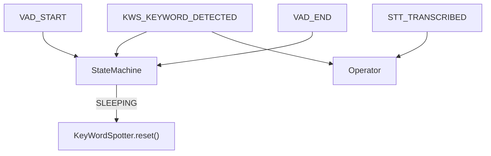
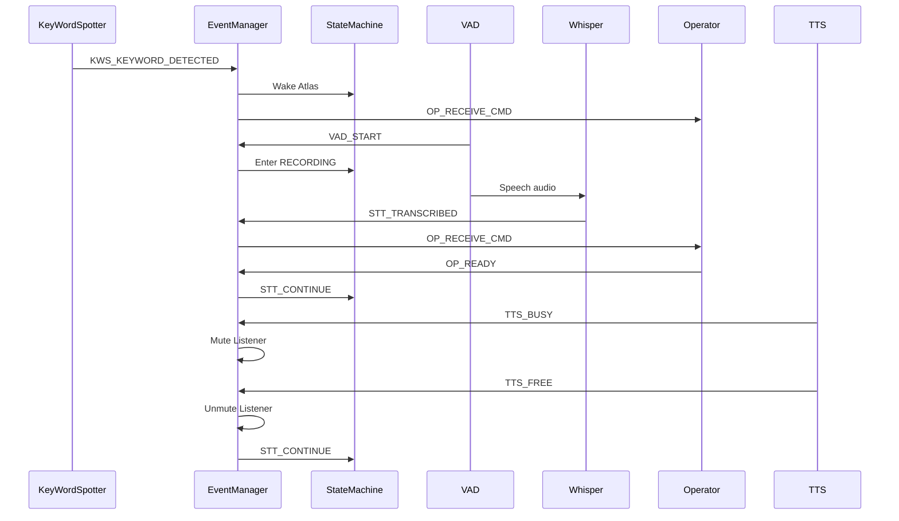
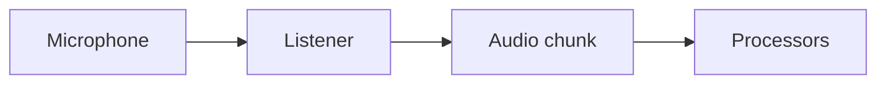
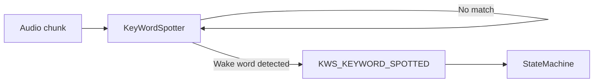
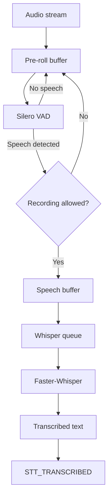
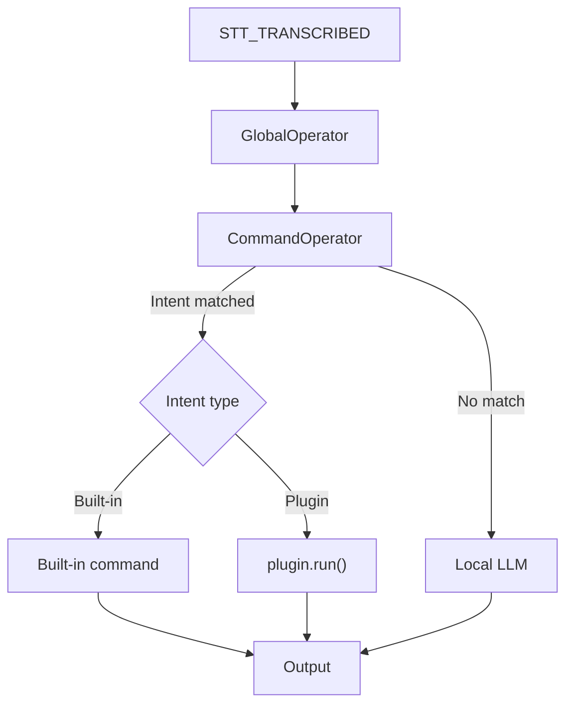
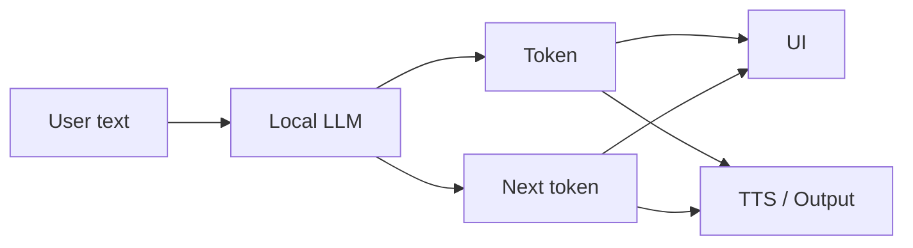
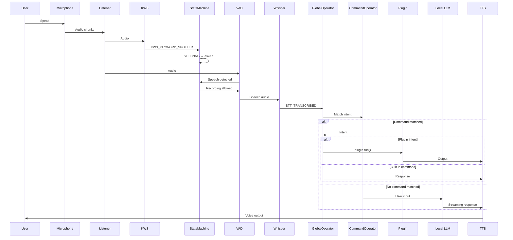

# Architecture

## Introduction

Atlas is a fast, fully offline voice assistant built around an **event-driven, concurrent architecture**.

This page serves as a deep technical dive into the assistant's implementation. It describes the core components, their responsibilities, and the underlying technologies—such as specialized ONNX models and local LLMs—that allow Atlas to maintain a lightning-fast, predictable response time without ever sending data to the cloud.

The system is split into specialized components responsible for audio input, wake-word detection, speech recognition, state management, command execution, LLM interaction, and voice output.

This separation allows the main processing pipeline to remain responsive while expensive operations such as speech recognition and LLM inference run independently.

!!! abstract "Architecture at a glance"
    Atlas can be roughly divided into four layers:

    **Input → Recognition → Decision → Output**

    Audio enters through the microphone, passes through wake-word and speech recognition, is interpreted as either a command or an LLM request, and finally produces audio and/or UI output.

---

### Runtime Lifecycle

Atlas starts from the `Atlas` orchestrator:

```python
Atlas.start()
```

Initialization and runtime execution are deliberately separated.

During initialization, `Atlas` creates the required components, connects them through the event system, and registers event subscriptions.

During startup, `Atlas.start()` loads models and other resources into memory. Once loading is complete, the individual components start their workers, queues, and processing loops.



!!! tip "Why load everything first?"
    Model loading is intentionally performed before the main runtime begins. This prevents expensive initialization work from appearing unexpectedly during normal interaction and keeps runtime latency predictable.

---

### System Architecture

At runtime, Atlas behaves as a collection of concurrent components communicating through events and queues.



The diagram above represents the logical architecture rather than the exact implementation details. Individual components may use additional queues, worker threads, or internal processing stages.

---

## Components

### EventManager

`EventManager` is the central event bus used for communication between Atlas components.

Rather than directly coupling components together, Atlas uses typed events to notify other components about state changes, audio processing stages, model availability, user input, and output requests.

Components can:

* **emit** an event;
* **subscribe** a callback to an event;
* react to events without knowing which component produced them.

The event system is therefore one of the main mechanisms responsible for keeping Atlas components loosely coupled.

#### Event Flow

A simplified event lifecycle looks like this:

```text
Component
    │
    │ emit_event(EventType, content)
    ▼
┌────────────────────┐
│    EventManager    │
│                    │
│    Event Queue     │
└─────────┬──────────┘
          │
          ▼
       Worker
          │
          ▼
   Registered callbacks
          │
     ┌────┼────┐
     ▼    ▼    ▼
    KWS   STT   UI
```

The event manager processes events asynchronously through its internal queue. Subscribers are then invoked when their corresponding events are received.

!!! note "Event payloads"
An event may optionally contain a `content` payload.

```
The meaning and expected type of `content` depends on the event. For example, `STT_TRANSCRIBED` carries recognized text, while `STT_CHANGED_STATE` carries the new speech-recognition state.
```

---

#### Event Types

Atlas currently defines the following event types:

**TTS Events**

| Event            | Purpose                                                            |
| ---------------- | ------------------------------------------------------------------ |
| `TTS_LOADED`     | Emitted when the TTS subsystem has finished loading.               |
| `TTS_SPEAK`      | Requests Atlas to synthesize and speak the provided text.          |
| `TTS_PLAY_SOUND` | Requests playback of a sound asset.                                |
| `TTS_BUSY`       | Indicates that TTS is currently producing or playing output.       |
| `TTS_FREE`       | Indicates that TTS has finished and the audio pipeline can resume. |

**Speech & Audio Events**

| Event                  | Purpose                                                              |
| ---------------------- | -------------------------------------------------------------------- |
| `KWS_LOADED`           | Emitted when the keyword-spotting model has finished loading.        |
| `WHISPER_LOADED`       | Emitted when the Whisper model has finished loading.                 |
| `VAD_LOADED`           | Emitted when the VAD model has finished loading.                     |
| `KWS_KEYWORD_DETECTED` | Emitted when the configured wake word is detected.                   |
| `VAD_START`            | Indicates that speech has started.                                   |
| `VAD_END`              | Indicates that speech has ended.                                     |
| `STT_AUDIOWAVE`        | Carries audio-waveform information for STT-related UI or processing. |
| `STT_CHANGED_STATE`    | Emitted when the STT state changes.                                  |
| `STT_TRANSCRIBED`      | Contains text produced by the speech recognizer.                     |
| `STT_SET_STATE`        | Requests a specific STT state.                                       |
| `STT_CONTINUE`         | Signals that the STT pipeline may continue processing.               |
| `STT_START`            | Indicates the beginning of an STT operation.                         |
| `STT_FINISH`           | Indicates the end of an STT operation.                               |

**Operator Events**

| Event            | Purpose                                                        |
| ---------------- | -------------------------------------------------------------- |
| `OP_ASK_FINISH`  | Requests Atlas to shut down.                                   |
| `OP_RECEIVE_CMD` | Sends a command or recognized input to the operator.           |
| `OP_READY`       | Indicates that the operator is ready to receive another input. |
| `OP_CMD_LEVEL`   | Provides command-processing level/status information.          |

**UI Events**

| Event                  | Purpose                                              |
| ---------------------- | ---------------------------------------------------- |
| `UI_BANNER`            | Requests or triggers the Atlas UI banner.            |
| `UI_STATE_CHANGE`      | Notifies the UI about an assistant state change.     |
| `UI_TRANSCRIPTION`     | Sends transcription data to the UI.                  |
| `UI_LLM_CHUNK`         | Sends a streamed LLM response chunk to the UI.       |
| `UI_LLM_RESPONSE`      | Sends an LLM response to the UI.                     |
| `UI_LLM_RESPONSE_DONE` | Indicates that LLM response streaming has finished.  |
| `UI_ASSISTANT_SAY`     | Sends assistant speech/output information to the UI. |

**LLM Events**

| Event          | Purpose                                    |
| -------------- | ------------------------------------------ |
| `LLM_RESPONSE` | Carries an LLM-generated response.         |
| `LLM_LOADED`   | Emitted when the LLM has finished loading. |

**Logging & Special Events**

| Event       | Purpose                                                     |
| ----------- | ----------------------------------------------------------- |
| `DEBUG_LOG` | Carries debug logging information through the event system. |
| `WILDCARD`  | Special subscription value (`*`) used to match all events.  |

---

#### Current Event Subscriptions

The following table summarizes the main subscriptions currently registered by `Atlas`.

| Event                  | Subscriber / Action                               | Purpose                                                       |
| ---------------------- | ------------------------------------------------- | ------------------------------------------------------------- |
| `TTS_SPEAK`            | `TextToSpeech.speak()`                            | Speak the supplied text.                                      |
| `TTS_PLAY_SOUND`       | `TextToSpeech.play_sound()`                       | Play a sound asset.                                           |
| `TTS_BUSY`             | `Listener.mute()`                                 | Prevent microphone input while TTS is busy.                   |
| `TTS_FREE`             | `Listener.unmute()`                               | Resume microphone input after TTS finishes.                   |
| `TTS_FREE`             | Emit `STT_CONTINUE`                               | Resume the STT pipeline after TTS finishes.                   |
| `STT_CHANGED_STATE`    | `KeyWordSpotter.reset()` when state is `SLEEPING` | Reset wake-word detection when Atlas goes back to sleep.      |
| `KWS_KEYWORD_DETECTED` | Emit `OP_RECEIVE_CMD`                             | Notify the operator that the wake word was detected.          |
| `KWS_KEYWORD_DETECTED` | `StateMachine.set_state(AWAKE)`                   | Wake Atlas after detecting the keyword.                       |
| `VAD_START`            | `StateMachine.set_state(RECORDING)`               | Enter the recording state when speech begins.                 |
| `VAD_END`              | `StateMachine.set_state(AWAKE)`                   | Return to the awake state when speech ends.                   |
| `STT_SET_STATE`        | `StateMachine.set_state()`                        | Change the STT state.                                         |
| `STT_TRANSCRIBED`      | Emit `OP_RECEIVE_CMD`                             | Forward recognized speech to the operator.                    |
| `OP_ASK_FINISH`        | `Atlas._shutdown()`                               | Shut down the assistant.                                      |
| `OP_RECEIVE_CMD`       | `Operator.submit()`                               | Submit a command to the operator queue.                       |
| `OP_READY`             | Emit `STT_CONTINUE`                               | Allow the STT pipeline to continue after operator processing. |

This gives the current core event flow:



---

#### Event-Driven Speech Pipeline

The event system connects the individual stages of the voice pipeline without requiring them to directly call each other.



---

#### Event Naming Convention

Atlas groups event names by the subsystem they belong to.

```text
TTS_*    → Text-to-speech
KWS_*    → Keyword spotting
VAD_*    → Voice activity detection
STT_*    → Speech-to-text
OP_*     → Operator
UI_*     → User interface
LLM_*    → Language model
DEBUG_*  → Debugging / diagnostics
```

This convention makes event names self-describing and makes it easier to identify which subsystem owns a particular event.

!!! tip "When adding a new event"
Prefer the existing subsystem prefix and use a descriptive event name.

````
For example:

```text
STT_TRANSCRIBED
STT_START
STT_FINISH
```

is preferable to generic names such as:

```text
START
FINISH
RESULT
```
````

---

#### Wildcard Subscriptions

`WILDCARD` is a special event type represented by:

```python
WILDCARD = "*"
```

It is intended for subscribers that need to observe **all events** rather than a specific event type.

This is particularly useful for infrastructure such as:

* debugging tools;
* event logging;
* tracing;
* diagnostics;
* development utilities.

For example, an event logger can use a wildcard subscription to observe the entire event stream without registering a callback for every individual event.

!!! warning "Use wildcard subscriptions carefully"
A wildcard subscriber receives every event produced by Atlas.

```
Heavy processing inside a wildcard callback can therefore introduce unnecessary overhead into the event-processing pipeline.
```

---

#### Plugin Integration

The event system is also part of the Plugin API.

Plugins can emit supported Atlas events through the `event` submit format:

```json
{
    "type": "event",
    "event": "<EventType>",
    "content": "<event content>"
}
```

For example, a plugin could emit:

```json
{
    "type": "event",
    "event": "STT_SET_STATE",
    "content": "AWAKE"
}
```

Atlas receives the event through the plugin IPC layer and forwards it into the normal event system.

!!! warning "Not every internal event is necessarily a public API"
The event list above describes the current Atlas implementation.

```
Plugin authors should prefer events explicitly documented as part of the Plugin API. Internal events may change without preserving backwards compatibility.
```

---

#### EventManager as the System Backbone

The EventManager is effectively the communication backbone of Atlas.

The relationship between the major subsystems can be summarized as:

```text
                         ┌─────────────┐
                         │ EventManager│
                         └──────┬──────┘
                                │
          ┌─────────────┬───────┼────────┬─────────────┐
          │             │       │        │             │
          ▼             ▼       ▼        ▼             ▼
         KWS           STT     State   Operator       UI
          │             │       │        │             │
          │             │       │        │             │
          └─────────────┴───────┴────────┴─────────────┘
                                │
                                ▼
                               TTS
                                │
                                ▼
                             Output
```

This architecture allows Atlas to add or replace individual components without requiring every other component to know about the implementation details of the replacement.

That decoupling is particularly important as Atlas grows and more plugins, UI features, and processing components are introduced.

### EventLogger

`EventLogger` provides centralized logging for the application.

Logging is especially important for Atlas because most of its runtime is asynchronous. A failure may occur inside a worker thread or processing queue without directly propagating to the main application.

Good logs therefore provide visibility into:

- component initialization;
- model loading;
- event processing;
- state transitions;
- audio processing;
- command recognition;
- plugin execution;
- LLM inference;
- errors and exceptions.

!!! warning "Asynchronous systems need good logging"
    When work is distributed across multiple threads and queues, logs are often the easiest way to determine **where** and **when** something went wrong.

---

### Listener

`Listener` owns the microphone input stream.

It continuously receives audio chunks and passes them through the configured processing pipeline.



The `Listener` is intentionally kept relatively simple. It is responsible for acquiring and distributing audio rather than deciding what that audio means.

Components such as the `KeyWordSpotter` and `SpeechRecognizer` perform the actual interpretation.

---

### KeyWordSpotter

`KeyWordSpotter` performs continuous wake-word detection.

Each audio chunk is passed to:

```python
process(audio_chunk)
```

When the configured wake word is detected, the component emits:

```text
KWS_KEYWORD_SPOTTED
```

The event is then consumed by the `StateMachine`.



This allows the wake-word detector to remain independent from the rest of the assistant's state management.

---

### SpeechRecognizer

`SpeechRecognizer` converts spoken audio into text.

It combines two models:

| Component | Responsibility |
|---|---|
| **Silero VAD** | Detects whether the user is currently speaking |
| **Faster-Whisper** | Converts speech into text |

The recognizer also maintains a **pre-roll buffer** containing recent audio. This ensures that the beginning of an utterance is not lost when VAD detects speech slightly after it has already started.

#### Recognition Pipeline



The important distinction is that **VAD detects speech, while the `StateMachine` decides whether Atlas is currently allowed to record it**.

This prevents Atlas from continuously collecting speech while it is in the sleeping state.

---

### StateMachine

`StateMachine` controls Atlas's high-level interaction state.

The primary states are:

```text
SLEEPING
   │
   │ KWS_KEYWORD_SPOTTED
   ▼
AWAKE
   │
   │ awake_timeout
   ▼
SLEEPING
```

#### Responsibilities

The state machine:

- reacts to `KWS_KEYWORD_SPOTTED`;
- transitions Atlas between `SLEEPING` and `AWAKE`;
- handles `STT_SET_STATE`;
- emits `STT_CHANGED_STATE`;
- tracks the `awake_timeout`;
- determines whether speech may be added to the recognition buffer.

The timeout is configurable and currently defaults to approximately **10 seconds**.

!!! info "Why is this centralized?"
    Speech recognition should not independently decide whether Atlas is awake. Keeping this decision inside the `StateMachine` gives the system a single source of truth for assistant state.

---

### GlobalOperator

`GlobalOperator` is responsible for interpreting transcribed user input and deciding what Atlas should do next.

It maintains its own queue and consumes:

```text
STT_TRANSCRIBED
```

The decision process can be summarized as:



---

#### CommandOperator

`CommandOperator` determines whether the user's text corresponds to a known intent.

Atlas uses semantic similarity rather than relying solely on exact string matching.

Command triggers and the user's input are converted into embeddings using `SentenceTransformers`. Their cosine similarity is then calculated.

```text
User input
    │
    ▼
SentenceTransformer
    │
    ▼
Input embedding
    │
    ├───────────────┐
    │               │
    ▼               ▼
Command trigger   Command trigger
embedding         embedding
    │               │
    └───────┬───────┘
            ▼
     Cosine similarity
            │
            ▼
       Threshold check
```

If the similarity exceeds the configured threshold, the corresponding intent is considered recognized.

!!! note
    This allows Atlas to recognize commands even when the user does not use the exact trigger phrase defined in `commands.json`.

---

#### Built-in Commands

Recognized built-in commands are generally executed by selecting an appropriate predefined response and sending it to the output system.

Some commands have additional assistant-level behavior.

For example:

- `farewell` may terminate or alter the current interaction;
- `sleep` may explicitly transition Atlas back into its sleeping state.

These commands therefore cannot always be represented as simple `"trigger → response"` mappings.

---

#### Plugins

Atlas also supports a plugin architecture.

When a recognized intent belongs to a plugin, `GlobalOperator` invokes:

```python
plugin.run()
```

Plugins can extend Atlas without requiring their functionality to be implemented directly inside the core assistant.

For more information, see the [Plugin API](/Atlas/plugins/).

!!! warning "Plugin architecture is still evolving"
    The boundary between built-in commands, plugins, and assistant-level behavior is not considered final.

    The current architecture is functional, but this area is expected to undergo further changes as the plugin system matures.

---

#### LLM Fallback

If `CommandOperator` cannot find a matching intent, `GlobalOperator` forwards the user's input to the local LLM.

Atlas currently uses a lightweight wrapper around `llama-cpp-python`.

The wrapper provides a common interface for local inference and supports **streaming responses**.



Instead of waiting for the complete response, Atlas can process generated tokens as they become available.

This reduces perceived latency and allows the UI and output pipeline to begin responding before the model has finished generating the entire response.

!!! tip "Why streaming matters"
    For an interactive voice assistant, perceived latency is often more important than total generation time.

    Starting output as soon as possible makes the assistant feel significantly more responsive.

---

### TextToSpeech

`TextToSpeech` is currently responsible for Atlas's voice output.

At present, its responsibilities include more than speech synthesis:

- text-to-speech generation;
- `speak()` functionality;
- sound playback;
- system sound generation;
- sound asset management;
- generation of `sounds/manifest.json`;
- integration with `commands.json`.

This makes `TextToSpeech` somewhat broader than its name suggests.

#### Planned separation

The current implementation is intentional but not considered the final architecture.

In the future, these responsibilities are expected to be split into separate logical components, for example:

```text
TextToSpeech
    │
    └── Speech synthesis

SoundManager
    │
    ├── Sound playback
    └── Sound assets

SoundGenerator
    │
    └── Manifest / generated sounds
```

This would reduce coupling and make each component easier to maintain independently.

---

## End-to-End Flow

The complete interaction cycle can be summarized as follows:



---

## Concurrency Model

Atlas is designed around concurrent processing rather than a single synchronous loop.

Different parts of the system can operate independently:

| Component | Main responsibility | Concurrency |
|---|---|---|
| `Listener` | Microphone input | Background processing |
| `KeyWordSpotter` | Wake-word detection | Audio processing |
| `SpeechRecognizer` | VAD + transcription | Workers / queues |
| `EventManager` | Event dispatch | Dedicated worker |
| `GlobalOperator` | Command / LLM routing | Dedicated queue |
| `LLM` | Model inference | Streaming generation |
| `TextToSpeech` | Voice output | Independent processing |

The exact implementation details may change as Atlas evolves, but the general principle remains:

> **Long-running or potentially expensive operations should not block unrelated parts of the assistant.**

This is especially important for audio processing, where blocking the microphone pipeline could result in dropped audio or increased interaction latency.

---

## Architectural Principles

Atlas currently follows several core principles.

!!! success "Low latency"
    Audio processing, event dispatch, command recognition, and model inference should be structured so that they do not unnecessarily block one another.

!!! success "Offline-first"
    Core assistant functionality is designed to run locally without requiring cloud inference or external APIs.

!!! success "Loose coupling"
    Components communicate through events and well-defined interfaces wherever practical.

!!! success "Modularity"
    Speech recognition, wake-word detection, command processing, LLM inference, and output are separated into independent components.

!!! success "Extensibility"
    The plugin system allows new functionality to be added without modifying the core assistant.

---

## Current Limitations & Future Work

Atlas's architecture is still evolving.

Some components currently have broader responsibilities than their final design should have. The most notable examples are:

- `TextToSpeech`, which currently also manages sound assets and generation;
- the distinction between built-in commands and plugins;
- assistant-level commands such as `sleep` and `farewell`;
- some interactions between the state machine and speech recognition.

The plugin and command architecture is therefore considered **work in progress**.

Future refactoring is expected to focus on:

- further decoupling components;
- making plugins and built-in commands follow a more uniform execution model;
- separating sound management from TTS;
- simplifying state management;
- reducing unnecessary dependencies between components;
- improving observability and debugging;
- preserving low-latency behavior as the system grows.

!!! warning "Architecture is not frozen"
    Atlas is an actively developed project. Interfaces, component boundaries, and execution flows described in this document may change as the project matures.

    This document describes the **current architectural direction**, not a promise that every implementation detail will remain unchanged.
