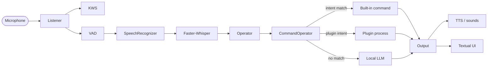
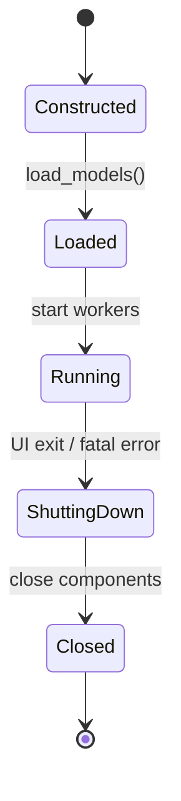
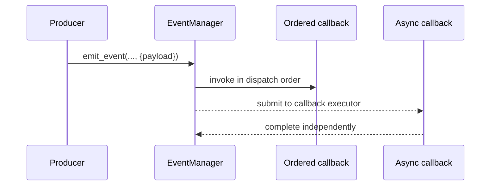
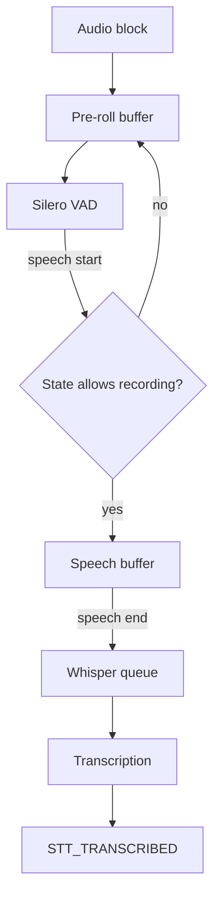
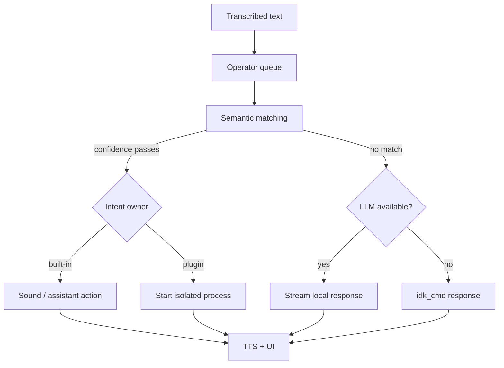
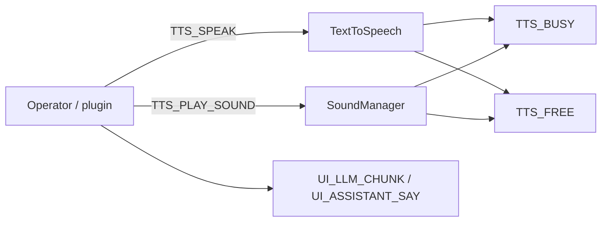

# Architecture

Atlas is a local, event-driven voice pipeline. Components have narrow responsibilities, communicate through queues and the event bus, and keep expensive work away from microphone callbacks.

## Runtime at a glance

| Layer | Responsibility | Main modules |
| --- | --- | --- |
| Input | Capture audio and keyboard wake-up | `Listener`, `KeyBindManager` |
| Recognition | Detect wake word, speech boundaries and text | `KeyWordSpotter`, `VAD`, `Whisper` |
| State | Decide whether Atlas may record and when it sleeps | `StateMachine` |
| Decision | Match built-in intents, start plugins, fall back to LLM | `CommandOperator`, `Operator`, `Llama` |
| Output | Synthesize speech, play cached sounds and render UI | `TextToSpeech`, `SoundManager`, `UI` |
| Coordination | Queue notifications and operation requests | `EventManager` |

## Lifecycle

`Atlas` constructs components and registers subscriptions before starting runtime workers.

The intended lifecycle vocabulary is:

- `load()` loads models or static resources;
- `start()` starts worker threads or streams;
- `close()` releases resources and is safe to call during shutdown.

Model loading is synchronous during startup. Audio processing, event dispatch, operator work, TTS and plugin execution use independent workers or subprocesses.

## Events and commands

Atlas uses one queue-based transport for two different concepts:

| Concept | Meaning | API |
| --- | --- | --- |
| Event | A fact that already happened | `emit_event(EventType, payload)` |
| Command | A request for a component to perform an operation | `command(CommandType, payload)` |

Both payloads are dictionaries. Empty payloads use `{}`. `Event` exposes the event/command name, `payload`, timestamp and `kind` (`event` or `command`).

Synchronous callbacks preserve ordering and are appropriate for state mutation. Subscribers may opt into asynchronous execution for independent work. Callback failures are logged by the event layer instead of terminating the dispatcher.

### Current command payloads

| Command | Payload |
| --- | --- |
| `TTS_SPEAK` | `{"text": str}` |
| `TTS_PLAY_SOUND` | `{"path": str or Path, "text": str or None}` |
| `OP_SUBMIT` | `{"text": str}` |

### Current event payloads

| Event | Payload |
| --- | --- |
| `KWS_KEYWORD_DETECTED` | `{"keyword": str}` |
| `STT_TRANSCRIBED` | `{"text": str}` |
| `STT_AUDIOWAVE` | `{"rms": float}` |
| `STT_CHANGED_STATE` | `{"state": str}` |
| `UI_STATE_CHANGE` | `{"state": str, "detail": str or optional}` |
| `UI_TRANSCRIPTION` | `{"text": str}` |
| `UI_LLM_CHUNK` | `{"text": str, "is_first": bool}` |
| `UI_ASSISTANT_SAY` | `{"text": str}` |
| `LLM_RESPONSE` | `{"text": str}` |
| `DEBUG_LOG` | `{"message": str, "source": str, "level": str}` |
| `*_LOADED`, `*_START`, `*_FINISH`, `TTS_BUSY`, `TTS_FREE` | `{}` |

Timing and benchmark measurements are intentionally not part of normal UI/event payloads. Benchmark tooling can measure model and pipeline performance separately without making runtime contracts noisy.

## Speech pipeline

The `StateMachine` is the authority for `SLEEPING`, `AWAKE`, `RECORDING` and `WAITING`. VAD detects acoustic speech; it does not decide whether Atlas should accept it.

## Decision pipeline

`CommandOperator` loads built-in commands from `config/commands.json`, discovers plugins and compares user text with trigger embeddings. `Operator` owns the queue and selects command or LLM execution.

## Output

`TextToSpeech` synthesizes streamed text and `SoundManager` handles cached sound categories and playback. Output events update the UI; output commands request work from TTS or sound playback.

The distinction matters: an event reports `TTS_BUSY`; a command asks Atlas to speak.

## Plugins and isolation

Plugins are subprocesses. Atlas sends invocation context through `stdin`, reads protocol messages from `stdout`, and reads structured logs from `stderr`. See [Plugin API](plugins.md) for the wire format.

This boundary protects the main process from plugin-specific dependencies and makes language-independent plugins possible. It is not a security sandbox; install only plugins you trust.

## Observability

`EventLogger` subscribes to `DEBUG_LOG` and writes daily files under `data/logs/`. The useful diagnostic categories are model loading, state transitions, command matching, plugin execution, output, and exceptions.

## Current boundaries and next steps

The architecture is deliberately in transition during v0.6:

- lifecycle contracts are being standardized;
- event payloads are dictionary-based;
- command identity is separate from event identity;
- built-in commands and plugins are candidates for a shared capability model;
- plugin protocol versioning is planned for v0.7;
- benchmark measurements belong in manual, fixture-driven tooling.

The stable rule for new integrations is simple: publish facts as events, request work as commands, keep payloads small and structured, and avoid reaching into another component's private state.
