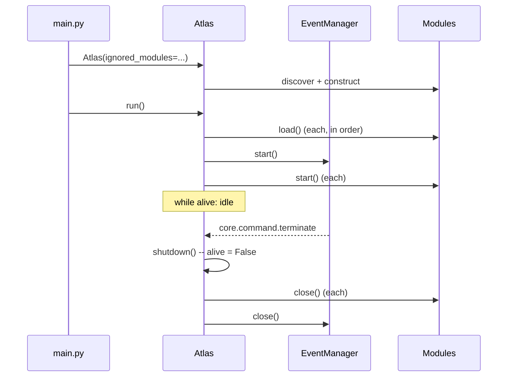

# Lifecycle

## `Module` contract

Every module implements three methods, called by `Atlas` in this order:

```python
class Module:
    def load(self) -> None:
        """Load models or other static resources. Synchronous, at startup."""

    def start(self) -> None:
        """Start worker threads/streams. Called after every module has loaded."""

    def close(self) -> None:
        """Release resources. Must be safe to call during shutdown."""
```

`Module.__init__(self, events)` also auto-registers every `@on_event`-decorated
method on the instance (see [Events](events.md)) — a subclass only needs to
call `super().__init__(events)`.

## Discovery

`Atlas.init_modules()` imports `atlas.modules` and calls
`discover_modules()`, which walks its subpackages, imports each
`<package>/module.py`, and collects every `Module` subclass it defines,
keyed by that class's `name` attribute:

```python
for name, cls in discover_modules(atlas.modules).items():
    if name not in self.ignored_modules:
        self.modules[name] = cls(self.events)
```

A module directory just needs to exist under `atlas/modules/<name>/` with a
`module.py` that defines exactly one `Module` subclass — nothing to register
by hand. See [Modules API](../modules-api.md) for the full convention.

## `Atlas` orchestration



`alive` and "closed" are two separate, deliberately decoupled flags:

- **`alive`** only gates the run loop in `_main()`. `shutdown()` (triggered by
  the `core.command.terminate` handler, or directly on `KeyboardInterrupt`)
  just flips it to `False`.
- **`_closed`** guards `close()`'s actual cleanup (closing every module,
  stopping the event bus), and makes `close()` idempotent — safe to call once
  from `shutdown()`'s caller and again from `run()`'s `finally` block, in
  either order, without double-running teardown or skipping it.

`close()` and `load_modules()`/`start()` log (and re-raise) any exception with
the failing module's name, so a broken module doesn't fail silently.

## Termination paths

- **Normal**: any module emits `core.command.terminate` (the `farewell`
  intent, or a UI quit action) → `Atlas._handle_terminate_event` spawns a
  daemon thread → `shutdown()` → `_main()`'s loop exits → `run()`'s `finally`
  calls `close()`.
- **Ctrl+C**: `KeyboardInterrupt` propagates out of `_main()` straight into
  `run()`, which emits `core.command.terminate` itself and falls through to
  the same `finally: self.close()`.
