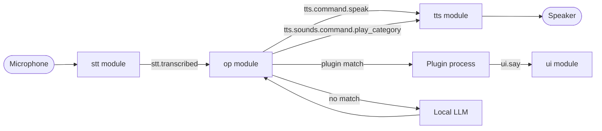

# Architecture overview

Atlas is a local, event-driven pipeline. A small orchestrator (`Atlas`) discovers
independent **modules**, wires them to one shared event bus, and drives their
lifecycle. Modules never call each other directly — they only emit and
subscribe to named events.



## Modules

| Module | Package | Responsibility |
| --- | --- | --- |
| `stt` | `atlas.modules.stt` | Wake word, VAD, transcription, recording state |
| `op` | `atlas.modules.op` | Intent matching, plugins, local LLM fallback |
| `tts` | `atlas.modules.tts` | Speech synthesis and cached sound playback |
| `ui` | `atlas.modules.ui` | Textual terminal UI (off by default, see below) |
| `keybinds` | `atlas.modules.keybinds` | Global hotkey → wake word event |

Each module is a self-contained package (`atlas/modules/<name>/`) with its own
`module.py`, its own config (see [Config](config.md)), and its own submodels.
`Atlas.init_modules()` finds them automatically — see [Lifecycle](lifecycle.md)
for how, and [Modules API](../modules-api.md) for how to add one.

!!! warning "The UI is currently disabled by default"
    `main.py` runs with `ignored_modules=["ui"]`. The Textual UI has a known
    threading conflict with `ctranslate2` (used by Faster-Whisper) that hasn't
    been resolved yet. Treat the `ui` module as rudimentary/experimental —
    everything else in these docs works independently of it.

## The three things that connect modules

- **Events** — the only way modules talk to each other. See [Events](events.md).
- **Config** — each module owns typed settings, loaded from its own TOML file
  or a shared one. See [Config](config.md).
- **Lifecycle** — `load()` → `start()` → `close()`, orchestrated by `Atlas`.
  See [Lifecycle](lifecycle.md).

## Where things live

```text
src/atlas/
├── core/           # Atlas orchestrator, EventManager, Module base class
├── modules/
│   ├── stt/        # wake word, VAD, whisper, state machine
│   ├── op/         # intent matching, plugins, LLM
│   ├── tts/        # piper synthesis, cached sounds
│   ├── ui/         # Textual UI (disabled by default)
│   └── keybinds.py # global hotkey → wake word
└── utils/          # config API, logging, shared paths
```
