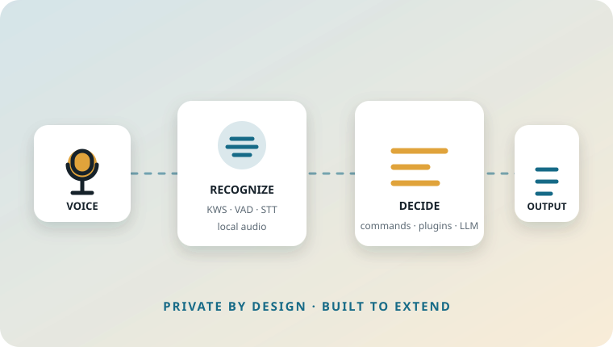
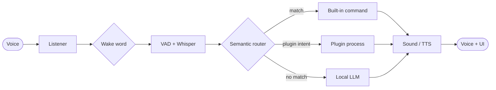

# Atlas

{ .atlas-hero-art }

## A private voice assistant for the desktop

Atlas turns local audio into useful actions and spoken responses. Wake-word detection, speech recognition, semantic command matching, plugins, a local LLM and TTS work together without sending voice or text to a cloud service.

[Install Atlas](installation.md){ .md-button .md-button--primary }
[Read the architecture](architecture.md){ .md-button }

## The shape of Atlas

## What is here today

| Area | Current implementation |
| --- | --- |
| Wake word | Sherpa-ONNX keyword spotter |
| Speech boundary | Silero VAD with pre-roll buffering |
| Transcription | Faster-Whisper |
| Routing | Sentence-transformer embeddings plus confidence thresholds |
| Extensions | Isolated JSON-lines plugin processes |
| Conversation fallback | Local GGUF model through `llama-cpp-python` |
| Voice output | Piper TTS and cached sound assets |
| Interface | Textual terminal UI |

!!! note "Offline means local models still need setup"
    Atlas does not require a cloud account at runtime. Initial model downloads and manually supplied LLM files are described in [Installation](installation.md).

## Choose a path

- :material-download-circle-outline: **[Install and configure](installation.md)**

    Requirements, source setup, model locations and the first launch checklist.

- :material-transit-connection-variant: **[Understand the pipeline](architecture.md)**

    Lifecycle, event/command contracts, concurrency and output flow.

- :material-puzzle-outline: **[Build a plugin](plugins.md)**

    Manifest format, process isolation, stdin/stdout messages and examples.

- :material-github: **[Open the repository](https://github.com/Minkx1/Atlas)**

    Source code, issues and release artifacts.

## Design compass

!!! abstract "Fast"
    Expensive work is isolated behind queues and workers so microphone processing remains responsive.

!!! abstract "Private"
    Recognition, routing, generation and speech synthesis run on the local machine.

!!! abstract "Extensible"
    Plugins are external processes. They can be written independently and communicate through a small IPC surface.

!!! warning "The API is evolving"
    Atlas is in the v0.6 stabilization phase. The [Plugin API](plugins.md) and event contracts describe the current implementation, not a frozen long-term protocol.
