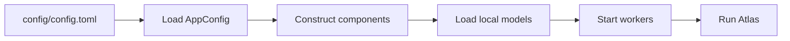

# Install Atlas

Atlas supports two paths: download a packaged build, or run the source tree for development and plugin work.

## Before you begin

| Resource | Baseline | Comfortable setup |
| --- | --- | --- |
| CPU | 4 x86_64 cores | 8+ cores |
| Memory | 4 GB RAM | 8 GB RAM or more |
| Storage | About 5 GB for core models | 10 GB+ with a local LLM |
| Operating system | Linux or Windows | Linux for easiest development |
| Python from source | 3.10 or newer | 3.11 |

A compatible microphone and speakers are required for the full assistant experience.

## Packaged release

1. Download the archive for your operating system from [GitHub Releases](https://github.com/Minkx1/Atlas/releases).
2. Extract it into a dedicated directory.
3. Run `./Atlas` on Linux or `Atlas.exe` on Windows.
4. Complete the model setup below.

The packaged build does not require a separate Python installation.

## From source

=== "Linux"

    ```bash
    git clone https://github.com/Minkx1/Atlas.git
    cd Atlas
    sudo apt-get install -y libportaudio2 portaudio19-dev libasound2-dev
    python3 -m venv .venv
    source .venv/bin/activate
    python -m pip install --upgrade pip
    python -m pip install ".[dev]"
    python main.py
    ```

=== "Windows"

    ```powershell
    git clone https://github.com/Minkx1/Atlas.git
    cd Atlas
    py -3.11 -m venv .venv
    .venv\Scripts\activate
    python -m pip install --upgrade pip
    python -m pip install ".[dev]"
    python main.py
    ```

    You can also use `scripts/install.bat` for the initial setup.

!!! tip "Development install"
    The `[dev]` extra includes pytest, coverage, Ruff, PyInstaller and Commitizen. Normal runtime users only need the package dependencies.

## Model locations

Atlas keeps runtime data below `data/`:

| Model or asset | Location |
| --- | --- |
| Whisper cache | `data/models/faster-whisper/` |
| Silero VAD | `data/models/vad/silero_vad.onnx` |
| Sherpa-ONNX KWS | `data/models/sherpa_onnx_kws/` |
| Piper voice | `data/models/piper/` |
| Sentence transformer | `data/models/sentence-transformer/` |
| Optional LLM | `data/models/llm_models/*.gguf` |

Some speech models download on first use when absent. The LLM is manual: place a compatible `.gguf` file in `data/models/llm_models/` and set `llm.model_path` in `config/config.toml`.

!!! warning "First launch can require internet"
    Model acquisition is an installation concern. Once the files are present, Atlas can run without network access. Keep model licenses and redistribution terms with any build you share.

## Configuration loop



The most useful first settings are:

- `stt.start_state`: usually `SLEEPING`;
- `stt.model_size` and `stt.device`;
- `tts.model_path` and `tts.length_scale`;
- `llm.model_path`;
- `kws.awake_keybind` for keyboard wake-up.

## Verify the development setup

```bash
ruff check .
pytest --cov=src --cov-report=term-missing
mkdocs build --strict
```

The regular test suite should not download large models. Model-heavy experiments belong in manual benchmark runs.
