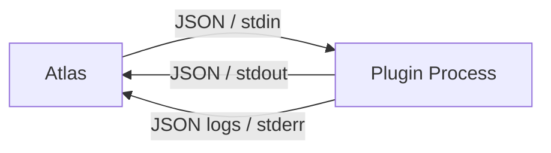
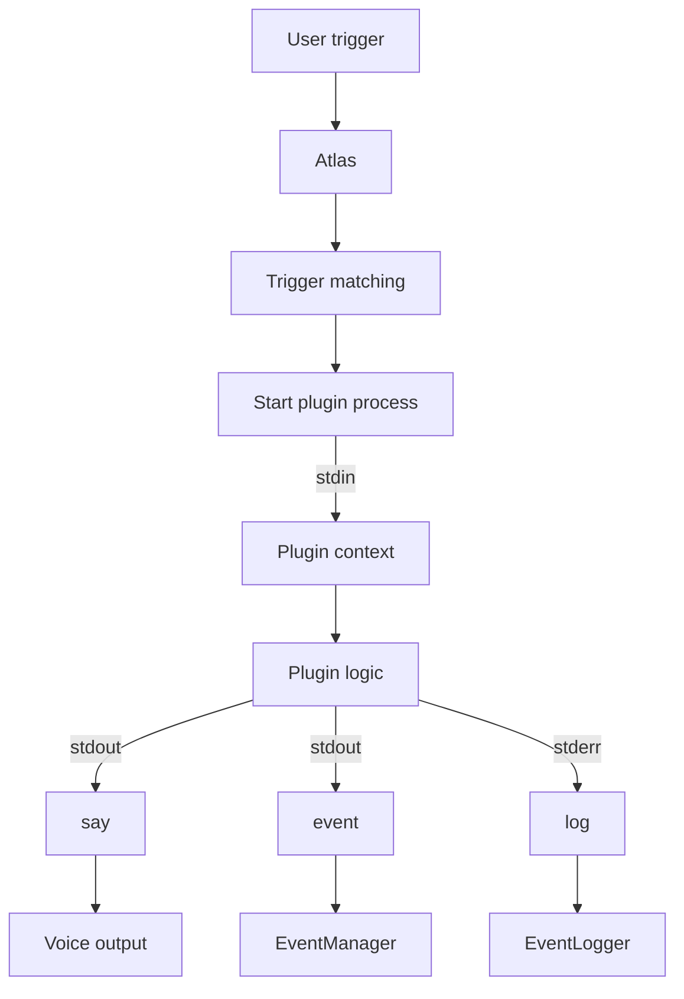

# Plugin Development Guide

Plugins are one of the core extensibility mechanisms of Atlas.

On its own, Atlas provides the basic voice-assistant infrastructure, but plugins allow developers to extend its capabilities far beyond the built-in functionality. A well-designed plugin can turn Atlas into a powerful automation tool capable of handling repetitive tasks across the desktop and other parts of the system.

!!! tip "Think of plugins as external applications"
Atlas plugins are intentionally isolated from the main Atlas process. A plugin communicates with Atlas through a small IPC interface rather than importing or modifying Atlas internals.

This makes it possible to write plugins in virtually any programming language.

---

## Plugin Structure

Atlas considers **any directory inside the configured `PLUGINS_DIR` (`plugins/`)** to be a plugin if it contains a `plugin.toml` file.

A plugin directory must contain:

```text
plugins/
└── plugin-example/
    ├── plugin.toml
    └── main.py
```

The `plugin.toml` file contains the plugin's metadata, trigger phrases, and execution configuration.

The plugin must also provide an **executable entry point** that communicates directly with the main Atlas process.

A minimal plugin therefore consists of:

1. A unique plugin directory.
2. A `plugin.toml` configuration file.
3. An executable entry point.

---

## `plugin.toml`

The plugin manifest is divided into two sections:

* `[plugin]` — metadata and activation triggers.
* `[execution]` — information about how Atlas should launch the plugin.

### Example

```toml
[plugin]

id = "plugin-example"
description = "Example plugin for the Atlas documentation."

triggers = [
    "Show example",
    "What's the example plugin?"
]

[execution]

type = "python"
file = "main.py"
timeout = 5.0
```

### `[plugin]`

| Field         | Required | Description                                                                                                       |
| ------------- | :------: | ----------------------------------------------------------------------------------------------------------------- |
| `id`          |    Yes   | Unique identifier of the plugin. Atlas uses this ID to associate the plugin with its triggers and other metadata. |
| `description` |    No    | Human-readable description of the plugin.                                                                         |
| `triggers`    |    Yes   | List of phrases that can activate the plugin.                                                                     |

!!! warning "Plugin IDs must be unique"
`plugin.id` must be unique across all installed plugins.

Treat the ID as a stable identifier rather than a display name.

### `[execution]`

| Field     | Required | Description                                |
| --------- | :------: | ------------------------------------------ |
| `type`    |    Yes   | Type of executable entry point.            |
| `file`    |    Yes   | File executed when the plugin is launched. |
| `timeout` |    Yes   | Maximum execution time in seconds.         |

Currently supported execution types are:

| Type     | Description                                                |
| -------- | ---------------------------------------------------------- |
| `binary` | Executes a native executable directly.                     |
| `python` | Executes a Python entry point.                             |
| `script` | Executes a script through the configured script mechanism. |

!!! tip "Choosing an execution type"
`binary` is generally the most self-contained option, especially for distributed plugins.

A native executable can be shipped together with the plugin without requiring the user to have the corresponding runtime installed.

---

## Plugin Execution

Atlas does not execute plugin code inside the main process.

Instead, each plugin runs as a separate process and communicates with Atlas through **IPC (Inter-Process Communication)**.

The current IPC interface uses:

* `stdin` — input from Atlas to the plugin;
* `stdout` — messages from the plugin to Atlas;
* `stderr` — logging from the plugin.

Messages exchanged through these channels use JSON.



This architecture provides an important level of isolation between Atlas and its plugins.

!!! info "Why separate processes?"
A plugin can crash, hang, or be implemented in a completely different programming language without requiring Atlas itself to be implemented in that language.

The execution timeout also allows Atlas to terminate plugins that do not finish within the configured limit.

---

## Writing a Plugin

Because the IPC protocol is language-independent, a plugin can theoretically be written in almost any programming language capable of reading from `stdin` and writing to `stdout`.

For simplicity, the examples below use Python.

A minimal Python plugin can look like this:

```python
import json
import sys


def get_context() -> dict:
    """Get the invocation context from stdin."""
    return json.loads(sys.stdin.readline() or "{}")


def submit(data: dict) -> None:
    """Submit a message to Atlas through stdout."""
    print(json.dumps(data), flush=True)


def log(
    message: str,
    source: str = "plugin-example",
    level: str = "INFO",
) -> None:
    """Send a log message to Atlas through stderr."""
    sys.stderr.write(
        json.dumps(
            {
                "type": "log",
                "message": message,
                "source": source,
                "level": level,
            }
        )
        + "\n"
    )
    sys.stderr.flush()


def main() -> None:
    context = get_context()

    response = {
        "type": "say",
        "text": "Hello, this is an example plugin!",
    }

    submit(response)


if __name__ == "__main__":
    main()
```

The important part is not the language itself, but the communication protocol.

The plugin:

1. receives its invocation context through `stdin`;
2. performs its own logic;
3. sends commands or events back to Atlas through `stdout`;
4. optionally sends structured logs through `stderr`.

---

## Plugin Context

When Atlas starts a plugin, it provides the plugin with a small **context object**.

The context is currently received through `stdin` as JSON.

### Current format

```json
{
    "origin": "<original text that triggered the plugin>"
}
```

The `origin` field contains the original user input that caused Atlas to invoke the plugin.

For example, if the user says:

```text
Show me the weather
```

the plugin may receive:

```json
{
    "origin": "Show me the weather"
}
```

!!! note "Context is intentionally minimal"
The plugin context is currently small and may be expanded in the future as more context becomes useful to plugins.

---

### Command Chaining

The invocation context can be useful for building conversational or chained interactions.

For example:

```text
User
  │
  ├── "Atlas"
  │
  ▼
"Yes, sir?"
  │
  ├── "Run a program"
  │
  ▼
"What program would you like me to run?"
  │
  ├── "Visual Studio"
  │
  ▼
"Right away, sir!"
```

In a future implementation, plugin context could allow plugins to participate in these kinds of multi-step interactions while retaining information about the original command.

!!! warning "Command chaining is WIP"
Command chaining is currently under active development and should be considered **experimental**.

The current implementation does not yet provide the complete behavior intended for the final architecture.

---

## Plugin Output

Plugins communicate their results to Atlas through `stdout`.

The `submit()` helper is a convenience wrapper around this communication channel:

```python
def submit(data: dict) -> None:
    print(json.dumps(data), flush=True)
```

Every submitted message must contain a valid `type` field so Atlas can determine how the message should be handled.

Currently supported message types are:

* `say`
* `event`
* `log`

---

### `say`

The `say` message instructs Atlas to produce a spoken response.

#### Format

```json
{
    "type": "say",
    "text": "<text Atlas should say>"
}
```

#### Example

```python
submit(
    {
        "type": "say",
        "text": "Hello, this is an example plugin!",
    }
)
```

Atlas receives the message and forwards the text to the appropriate output system.

---

### `event`

The `event` message allows a plugin to emit an Atlas event.

#### Format

```json
{
    "type": "event",
    "event": "<valid EventType>",
    "content": "<content valid for the selected event type>"
}
```

The `event` field must contain a valid Atlas `EventType`.

The format and expected contents of each event depend on the selected event type.

For the complete list of supported event types, see the [EventManager documentation](architecture.md#eventmanager).

!!! warning "Event types are part of the Atlas API"
Plugins should only emit documented and supported event types.

Internal event types may change as Atlas evolves and should not be relied upon unless they are explicitly part of the plugin API.

---

### `log`

Plugins can send structured log messages through `stderr`.

The recommended approach is to use the `log()` helper rather than manually submitting log messages through `submit()`.

#### Format

```json
{
    "type": "log",
    "message": "<log message>",
    "source": "<plugin identifier>",
    "level": "<log level>"
}
```

A typical plugin should identify itself through the `source` field.

For example:

```python
log(
    "Starting weather lookup",
    source="weather-plugin",
    level="INFO",
)
```

This makes it immediately clear which plugin generated the message when reading Atlas logs.

!!! warning "Do not use `submit()` for logging"
Although a log message can technically be submitted through the same IPC mechanism as other messages, this is not recommended.

Prefer the dedicated `log()` helper:

```python
log("Something happened")
```

instead of manually constructing a log payload.

---

## Complete Example

A complete minimal plugin can therefore look like this:

```text
plugins/
└── plugin-example/
    │
    ├── plugin.toml
    │
    └── main.py
```

### `plugin.toml`

```toml
[plugin]

id = "plugin-example"
description = "Example plugin for Atlas."

triggers = [
    "Show example",
    "What's the example plugin?"
]

[execution]

type = "python"
file = "main.py"
timeout = 5.0
```

### `main.py`

```python
import json
import sys


def get_context() -> dict:
    return json.loads(sys.stdin.readline() or "{}")


def submit(data: dict) -> None:
    print(json.dumps(data), flush=True)


def log(
    message: str,
    source: str = "plugin-example",
    level: str = "INFO",
) -> None:
    sys.stderr.write(
        json.dumps(
            {
                "type": "log",
                "message": message,
                "source": source,
                "level": level,
            }
        )
        + "\n"
    )
    sys.stderr.flush()


def main() -> None:
    context = get_context()

    log(f"Triggered by: {context.get('origin', '<unknown>')}")

    submit(
        {
            "type": "say",
            "text": "Hello, this is an example plugin!",
        }
    )


if __name__ == "__main__":
    main()
```

---

## Plugin API Summary

The current plugin API can be summarized as follows:



The plugin itself remains responsible for its internal logic, while Atlas remains responsible for:

* detecting the trigger;
* starting the plugin;
* providing invocation context;
* enforcing the execution timeout;
* processing plugin output;
* integrating plugin output with the rest of the assistant.

---

## Design Considerations

The plugin architecture intentionally favors **process isolation and a small communication interface** over direct access to Atlas internals.

This has several benefits:

!!! success "Language independent"
Plugins are not tied to Python. Any language capable of communicating through standard input/output can be used.

!!! success "Process isolation"
A plugin runs independently from the main Atlas process.

!!! success "Simple interface"
Plugins only need to understand a small JSON-based protocol.

!!! success "Extensible"
New plugin capabilities can be added without modifying the core assistant.

!!! success "Controlled execution"
Atlas can enforce a maximum execution time through the plugin timeout.

At the same time, the current API is still relatively low-level.

Future versions may introduce higher-level abstractions for:

* command chaining;
* richer plugin context;
* plugin configuration;
* asynchronous plugin execution;
* structured responses;
* plugin lifecycle management;
* better error reporting;
* plugin-to-plugin communication.

!!! warning "The Plugin API is in deep WIP"
The plugin system is one of the actively evolving parts of Atlas.

The current API should be considered a stable **direction**, but not necessarily a permanently frozen interface. Major architectural changes may be introduced as the plugin system matures.
