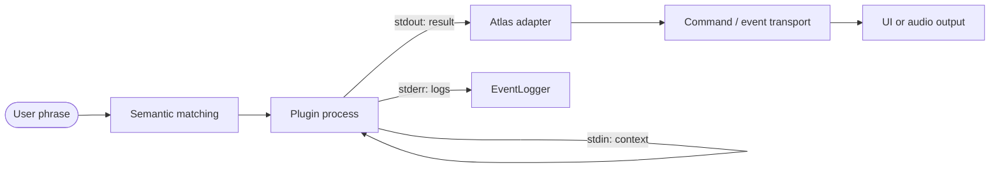

# Plugin API

Plugins extend Atlas without importing its internals. Each plugin is an external process with a small JSON-lines interface.

## Mental model



Atlas owns discovery, trigger matching, process startup, timeout enforcement and output integration. The plugin owns its logic and dependencies.

## Directory layout

Any directory below `plugins/` with a `plugin.toml` is discovered as a plugin.

```text
plugins/
└── say_time/
    ├── plugin.toml
    └── main.py
```

## Manifest

```toml
[plugin]
id = "say-time"
description = "Says the current time."
triggers = [
    "what time is it",
    "what's the time",
]

[execution]
type = "python"
file = "main.py"
timeout = 5.0
```

| Field | Required | Meaning |
| --- | :---: | --- |
| `plugin.id` | yes | Stable unique identifier used by routing. |
| `plugin.description` | no | Human-readable description. |
| `plugin.triggers` | yes | Phrases used by semantic command matching. |
| `execution.type` | yes | Current implementation supports `python` and direct `binary` execution. |
| `execution.file` | yes | Entry point relative to the plugin directory. |
| `execution.timeout` | yes | Maximum runtime in seconds; `0` disables the timer. |

!!! warning "Treat IDs as public identifiers"
    Do not reuse an existing plugin ID for an unrelated capability. Protocol validation and richer capability metadata are planned for the next plugin protocol revision.

## Invocation context

Atlas writes one JSON object to plugin `stdin`, then closes the stream:

```json
{
  "origin": "what time is it"
}
```

`origin` is the original recognized text. Keep plugins tolerant of additional future fields.

## Output messages

Each line written to `stdout` must be a JSON object with a `type` field.

### `say`

Requests spoken output. Atlas routes the text through the `TTS_SPEAK` command and notifies the UI.

```json
{
  "type": "say",
  "text": "It is 14:30"
}
```

### `event`

Forwards a supported `EventType` with a dictionary payload.

```json
{
  "type": "event",
  "name": "UI_ASSISTANT_SAY",
  "content": {
    "text": "The plugin finished."
  }
}
```

Unknown event names are rejected and logged by Atlas. Prefer `say` for ordinary voice output; use events only when the event is explicitly part of your integration contract.

### `done`

Marks plugin work as complete. It currently carries no required fields.

```json
{
  "type": "done"
}
```

## Logging

Write structured logs to `stderr`, not `stdout`:

```python
import json
import sys


def log(message: str, level: str = "INFO") -> None:
    print(
        json.dumps({
            "type": "log",
            "message": message,
            "source": "say-time",
            "level": level,
        }),
        file=sys.stderr,
        flush=True,
    )
```

`stdout` is reserved for protocol messages. A stray print can be interpreted as an invalid plugin response.

## Minimal Python plugin

```python
import json
import sys
import time
from random import choice


def main() -> None:
    context = json.loads(sys.stdin.readline() or "{}")
    log(f"Triggered by: {context.get('origin', '<unknown>')}")

    current_time = time.strftime("%H:%M")
    submit({
        "type": "say",
        "text": choice([f"Time is {current_time}", f"It is {current_time}"]),
    })
    submit({"type": "done"})


def submit(message: dict) -> None:
    print(json.dumps(message), flush=True)


def log(message: str) -> None:
    print(json.dumps({
        "type": "log",
        "message": message,
        "source": "say-time",
        "level": "INFO",
    }), file=sys.stderr, flush=True)


if __name__ == "__main__":
    main()
```

## Operational rules

- Keep startup and output bounded by the manifest timeout.
- Use paths relative to the plugin directory.
- Flush every protocol line.
- Never depend on Atlas Python objects or private modules.
- Return structured output rather than logging it to `stdout`.
- Assume the protocol will gain a version field in a future release.

!!! info "Isolation is a feature, not a limitation"
    A crash or blocked plugin should not corrupt Atlas's Python process. The boundary also keeps plugin dependencies separate from the assistant's dependency set.
